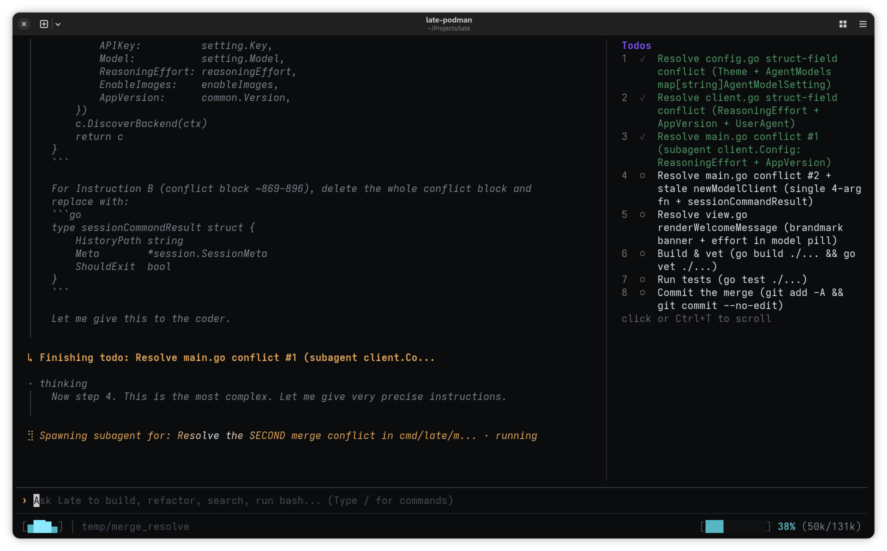

<h1 align="center">Late</h1>

<p align="center">
  <a href="README.md">English</a> | <a href="README.zh-CN.md">简体中文</a>
</p>

<p align="center">
  <b>始终保持敏锐的 AI 智能体。</b><br><br>
  <b>64k 上下文窗口。200k+ tokens 的工作量。</b><br>
  Late 通过隔离执行步骤，在长周期工作流中保持模型上下文的纯净。<br>
  零配置接入任何项目。支持任何云端 Provider 或本地模型。<br>
</p>

<p align="center">
  <a href="https://github.com/mlhher/late-cli/releases"></a>
  <a href="https://github.com/mlhher/homebrew-late"></a>
  <a href="https://github.com/mlhher/late-cli/"></a>
  <a href="https://deepwiki.com/mlhher/late-cli"></a>
</p>

> [在本地 LLM 工作流中超越 Claude Code 和 Codex](https://agentnativedev.medium.com/outperforming-claude-code-and-codex-for-local-llm-workflows-5de0e2b1add5) — Agent Native
>
> **“你解决了我的本地 AI 编程问题。”** — Reddit
>
> **“Late-CLI 太惊艳了……它是真正的隐藏宝藏。”** — GitHub Discussions
>
> **“同一个模型在 Late 里感觉更聪明。”** — Reddit
>
> **Built with Late：** Late 本身主要就是使用 Late 开发的。

<div align="center">
  <br/>
  
  <br/>
    <i>Late 自主规划、委托并解决复杂的多步合并冲突。</i>
  <br/><br/>
</div>

## 10 秒快速开始

单个静态编译二进制文件。零依赖。无需 Python venv，也无需 Node.js。

```bash
# Linux / macOS (Homebrew)
brew tap mlhher/late && brew install late
```

```bash
# 通用安装方式（Linux / macOS / Windows WSL）
curl -sfL https://raw.githubusercontent.com/mlhher/late-cli/main/install.sh | bash
```

```bash
# 在任意项目中以交互模式启动
cd your-project
late
```

**手动下载二进制文件：[Linux、macOS、原生 Windows](https://github.com/mlhher/late-cli/releases)**

> **预发布版本说明：** 本 README 文档描述了 **[v2.0.0-rc.1](https://github.com/mlhher/late-cli/releases/tag/v2.0.0-rc.1)**（预发布版本）中的功能特性。最新稳定版本为 **[v1.5.1](https://github.com/mlhher/late-cli/releases/tag/v1.5.1)**。这两个版本的二进制文件均可在 [GitHub Releases](https://github.com/mlhher/late-cli/releases) 获取。

一个二进制文件。零配置。如果 `llama-server` 已经运行，Late 会自动发现它。

📖 [**阅读快速入门指南**](./docs/quickstart.zh-CN.md)，了解持久化设置、完全自主的容器化工作流、MCP 和 Skills 配置、Git worktrees、快捷键等设置详情。

## 架构瓶颈

**问题：** 标准编程智能体仍然让主智能体直接吸收代码库扫描、编译器错误、文件读取、失败的 diff 和重试结果，并把这些内容不断堆积到同一条持续膨胀的轨迹里。随着这些执行噪音在 KV 缓存中累积，模型的推理质量会严重下降。你以为是模型的问题，其实是架构的问题。

> **1. 40% 崩塌：** 即使所有 token 在技术上都与任务相关，一旦上下文利用率跨过 40–50%，长上下文 LLM 的**推理准确率最高仍会下降约 45%**（[Weiwei Wang et al., arXiv 2026: Intelligence Degradation in Long-Context LLMs](https://arxiv.org/abs/2601.15300)）。
>
> **2. 过度思考税：** 推理模型会把**27%–51% 的轨迹浪费在冗余的自我反思循环**（“Wait...”、“Hmm”）上，却没有带来准确率提升（[Chenlong Wang et al., EMNLP 2025: Wait, We Don't Need to "Wait"! Removing Thinking Tokens Improves Reasoning Efficiency](https://arxiv.org/abs/2506.08343)）。

<br/>

**Late 的解决方案：** Late 将“思考”和“执行”拆开，并把**核心上下文视为稀缺资源**：

1. **架构级强制隔离：** 主编排器严格负责规划与验证。它会在彼此隔离的上下文中启动临时的 Coder 和 Researcher 子智能体。当子智能体完成原子任务后，其充满执行噪音的草稿上下文会被销毁。只有结构化、高信息密度的诊断结果会返回给主编排器。

2. **一次性测试时算力：** Worker 可以消耗远超单条有效推理轨迹所能干净容纳的总推理量。Late 用廉价算力换取有界、高信噪比的编排器上下文。

3. **经验性 Logit 偏置：** Late 为 `llama.cpp` / `llama-server` 实现了实时 logit biasing。它会动态抑制冗余的思考 token，回收浪费在 CoT 上的算力，同时为真正有用的推理保留空间（效果因模型而异）。

4. **物理工具注册表裁剪：** 编排器没有文件写入工具，仓库修改类 Bash 命令会被阻止，也无法绕过委托机制。子智能体没有编排工具，也不能递归创建其他智能体。

请参阅[功能矩阵](#功能矩阵)和[常见问题](#常见问题)，了解直接对比和真实使用案例。

<div align="center">
  <br/>
  
  <br/>
</div>

编排器上下文的增长主要来自真正重要的内容：你的指令、计划以及可验证的结果，而不是为了得到这些结果而产生的每一次 grep、编译器追踪、失败修改和被放弃的假设。

**一个拥有 64k 上下文窗口的模型，不再只能处理 64k 规模的任务。** 累计任务可以增长到数十万 tokens，而编排器仍保持在自身有效的上下文预算内，把新的工作委托到全新的上下文中，而不是继续背负完整的执行历史。

**同一个模型在 Late 中感觉更聪明，是因为这套架构保护了它做出重要决策时所使用的上下文。**

---

## 功能矩阵

|               | Late                                         | 传统智能体循环                                     |
| :------------ | :------------------------------------------- | :------------------------------------------ |
| **工作流**       | **自主编排：始终处于规划状态**                            | 手动切换 Build / Plan 模式                        |
| **实现任务**      | **强制使用临时 Coder 子智能体（完成即清空）**                 | 委托可选，或与主上下文直接执行混用                           |
| **探索任务**      | **强制使用临时 Researcher 子智能体（完成即清空）**            | 探索过程仍可能累积在主轨迹中                              |
| **工具强制约束**    | **物理工具命名空间裁剪（硬边界）**                          | 通常依赖策略 / prompt                             |
| **KV 缓存**     | **严格保护 KV 缓存（确定性前缀）**                        | 粗暴堆入上下文，并通过模式切换破坏缓存                         |
| **Logit 偏置**  | **原生 EMNLP 2025 token 抑制（削减 CoT 膨胀）**        | 无（每一轮都承担完整的过度思考开销）                          |
| **启动时间**      | **即时启动（原生 Go，<10ms，像 `htop` 一样轻快）**          | 1s–3s+（Node.js / Python 运行时）                |
| **系统 Prompt** | **约 1,000 tokens（精简且专注）**                    | 3,000–10,000+ tokens（从毫无工作流到过度约束的臃肿 prompt） |
| **沙箱**        | **原生 rootless devcontainers（`late-podman`）** | 无等价的内置工作流                                   |
| **所需配置**      | **无（自动连接 `:8080` 上的 `llama-server`）**        | 需要配置 provider / 模型                          |
| **遥测**        | **无**                                        | 默认启用遥测                                      |

<p align="center"><b>如果 Late 让你的模型感觉更聪明，<a href="https://github.com/mlhher/late-cli">欢迎在 GitHub 上给它一个 ⭐</a></b></p>

---

## 常见问题

**为什么不用可以直接编辑仓库的传统智能体？**

因为“可选委托”和“架构边界”不是一回事。如果主智能体仍然可以继续读取文件、执行命令、编辑代码、重试补丁并直接吸收工具输出，那么它的核心轨迹仍然会随着工作量不断膨胀。

Late 让这种情况无法发生。编排器负责规划与验证，隔离的 Worker 负责执行。这种结构性的纪律能确保模型不会陷入执行噪音中，也不会因此收敛于不完整的解决方案。Late 会在干净的上下文中持续拆解任务，直到所有目标全部完成。

**其他工具不是也已经有子智能体了吗？**

很多现代工具都有子智能体。真正的区别在于是否强制执行：在 Late 中，Worker 不是一条可以由主智能体选择绕过的可选支路。Late 会在**架构层面强制执行**隔离：

* **强制先规划再拆解：** 在触碰代码之前，任务会先被拆解成原子化、可验证的步骤。

* **可执行的诊断报告：** 子智能体返回结构化、高信息密度的报告，而不是有损摘要，让编排器专注于它最擅长的事情：**规划**（仅此而已）。

* **工具注册表裁剪：** 编排器从物理层面上就没有文件写入工具，因此无法贸然直接修改代码。子智能体则没有编排工具，也不能递归创建智能体。

**不能用插件重建这套工作流吗？**

如果一个智能体系统的底层编排循环从一开始就不是围绕这种架构设计的，那么即使通过插件或扩展尝试加入隔离，也无法真正强制执行这种边界。Late 不只是“提供子智能体”，而是在架构层面强制使用它们。编排器在物理上无法编辑文件（无论通过工具还是 Bash），而 Worker 在架构上与编排职责彻底分离。第三方插件无法复刻这种结构性约束。

**小型或量化的本地模型真的能处理复杂的真实世界任务吗？**

可以。这正是 Late 被设计出来要解决的问题。

反复使用通过 `llama-server` 运行的**35B-A3B、3-bit 量化模型**进行本地测试时，我们观察到了一个稳定一致的模式：Late 可以消耗远超编排器自身需要保留的总推理量。

在一次具有代表性的运行中，所有智能体累计执行了**200,000+ tokens**，而编排器始终保持在 **64k tokens 以下**。模型自主解决了一个相互交织的 6 文件 merge conflict，其中包含跨文件重构、重复逻辑和微妙回归；随后在一次性的 `late-podman` 容器中成功编译并通过了全部测试。同一个模型在传统的单体架构中处理相同任务时，随着工作轨迹增长而反复失败。

这就是 Late 面向本地模型的实际原因：**它把上下文容量问题转化为算力问题。** 如果推理发生在本地，或者足够便宜，你就可以投入更多 Worker 算力，而不是要求一个越来越被污染的上下文记住所有事情。在本地测试中，这让较小的模型能够持续处理规模更大、周期更长的任务，远超单条有效轨迹通常能够承载的范围。

**这不会造成智能体之间信息丢失的“传话游戏”吗？**

不会。在真实世界测试中，结果恰恰相反。

子智能体会被明确要求返回简洁的摘要，包括它做了什么、什么有效、相对于原始计划发生了哪些变化，以及哪些架构假设可能是错误的。这样，编排器可以专注于重要的失败并迅速调整方向，而不必继承执行过程中产生的每一次文件读取、Git 操作、测试结果、lint 错误和构建日志。

在测试中，Qwen3.6-35B-A3B 及其 finetune 等模型能够返回结构化摘要，使编排器无需继承 Worker 的完整推理历史，就能立即调整后续轨迹。这让核心上下文持续聚焦于整体架构，并让 Late 能够投入显著更多的一次性 Worker 算力，而不会拖累那个真正负责重要决策的上下文。

模型没有变。架构变了。

**除了子智能体之外，Late 还做了什么？**

Late 被设计成一个端到端的 agent harness：

* **完整插件系统：** 可从默认 registry、npm、Git 仓库或本地目录安装插件，并完整支持任何语言实现的自定义 Skills、slash 命令、主题和生命周期 hooks。

* **Sub-10ms 启动：** 原生 Go 二进制文件，零运行时依赖。像 `htop` 或 `nvim` 一样瞬间启动，避免 Node.js 或 Python 带来的迟缓启动时间和额外内存占用。

* **主动认知锚定：** Late 不会让模型盲猜工具语义，而是在相关时机注入有针对性的上下文提示和 sentinel 反馈，让模型把算力从理解工具机制中释放出来，专注于解决代码问题。

* **零 Prompt 重处理：** 与那些手动切换“Plan”和“Build”模式、导致 prompt cache 失效并推高延迟与成本的工具不同，Late 始终维持确定性、缓存稳定的 prompt 前缀。

* **精确范围控制，而非 AST 膨胀：** Late 不会在每一轮把数千个静态 AST tokens 塞进 prompt，而是由编排器直接向子智能体提供精确的行范围和任务指令。

**Late 支持本地模型吗？**

零配置。让 `llama-server` 加载任意 GGUF，Late 就会自动连接到 `:8080`。

---

## 模型连接

Late 完全与模型无关。

**本地模型（零配置）：**

无需任何配置。Late 默认连接端口 `:8080` 上的 `llama.cpp`（即 `llama-server` 的默认端口）。

**云端 Provider（DeepSeek、Claude、GPT、Kimi、GLM、OpenRouter）：**

```bash
export OPENAI_BASE_URL="your-api-url"
export OPENAI_API_KEY="your-api-key"
export OPENAI_MODEL="model-name"
```

---

## 功能

* **通用插件系统：** 使用自定义 slash 命令、MCP 服务器、主题和生命周期 hooks（`onSessionStart`、`onMessageSend`、`onToolCall`、`onToolResult`）扩展 Late。可直接通过 `late plugin install <package>` 安装。子智能体会自动继承已启用的插件。

* **经验性 Logit 偏置：** 基于 [Chenlong Wang et al., Findings of EMNLP 2025](https://arxiv.org/abs/2506.08343)，Late 通过 `llama-server` 动态抑制推理模型中重复的自我反思 token（“Wait...”、“Hmm”），可减少 27%–51% 的 CoT token 膨胀，同时不损失准确率（效果可能因模型而异）。

* **通过 Podman 实现过夜无人值守（`late-podman`）：** 在支持 devcontainer 和 `yolo mode` 的隔离 rootless 容器沙箱中运行智能体。可以让 Late 通宵执行大规模重构，而无需让宿主机承担同等风险。

* **交互式模型切换与混合路由：** 使用 `/model` 即时重新配置编排器和 Worker 模型。可以把规划路由到前沿推理模型，同时把执行委托给快速、高性价比的 Worker。

* **开发者体验：**

  * `/compose`：打开你偏好的 `$EDITOR`（Neovim、Vim、Helix、VS Code），编写复杂的多行指令。
  * `/rewind`：可视化历史回溯器，用于回退轮次并从旧的对话状态创建分支。
  * `late --prompt "..."`：使用预设 prompt 启动会话，适合从其他脚本中调用 Late。

* **可审计的子智能体历史：** 完整的子智能体对话记录和元数据都会持久化到磁盘，便于彻底审计和调试，同时不会污染编排器的活动上下文窗口。可选的持久化机制可以节省磁盘空间，同时确保你仍能调试过夜无人值守任务。

* **精确匹配 Diff 与自主修复：** 严格的 `search` / `replace` 编辑机制，并在匹配失败时自动尝试自我修复。修改会明确失败，绝不会悄悄损坏文件。

* **预防式 Sentinel 反馈：** 内置工具守卫会检测常见的智能体失败模式，并在模型陷入幻觉循环之前立即注入纠正性上下文。

* **真正的 cl100k BPE 离线 Tokenizer：** 内置 tokenizer 可离线计算真实 BPE token 数，无需任何启发式估算。

* **原生上下文感知搜索：** 高性能代码库搜索，使用 globster 过滤，并遵循 `.gitignore` 和 `.llmignore`。

* **Agent Skills 与 MCP 支持：** 原生支持外部 Model Context Protocol（MCP）服务器和第三方 Agent Skills，几乎无需额外配置。

* **Git Worktree 支持：** 可在多个分支上同时运行彼此独立的并行智能体实例，且不会发生上下文串扰。

---

## 许可证

Late 的目标是创造工程杠杆，而不是免费为 AI 初创公司提供基础设施。

* **开发者免费：** 你可以免费使用 Late 为任何项目编写代码，包括商业项目。生成的代码归你所有。

* **商业基础设施：** 不得对 Late 本身进行商业变现。若要将 Late 的编排引擎包装进付费服务，需要签订商业协议。**（2030 年 2 月 21 日转为 GPLv2。）**
